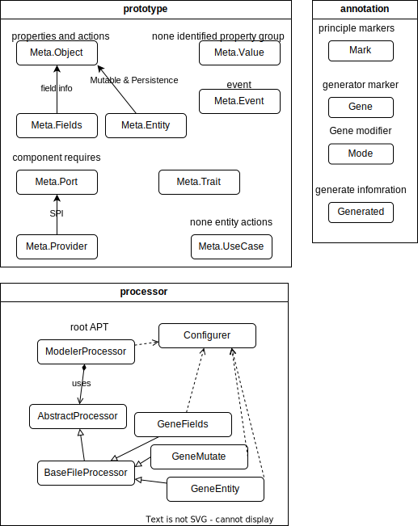

<p>


<a href="https://central.sonatype.com/search?smo=true&q=modeler&namespace=io.github.zenliucn.domain">

</a>
</p>

# Domain

Utilities and implements for Domains

## License

License as `GPL v2 with classpath exception`.

## module

1. modeler:  prototype and APT for domain design.

### modeler
a toolset for domain design.
```xml
<dependecies>
    <dependecy>
        <groupId>io.github.zenliucn.domain</groupId>
        <artifactId>modeler</artifactId>
        <version>0.1.0</version>
    </dependecy>
    <!-- required for use ModelerProcessor -->
    <dependency>
        <groupId>com.squareup</groupId>
        <artifactId>javapoet</artifactId>
        <version>1.13.0</version>
        <optional>true</optional>
        <scope>provided</scope>
    </dependency>
</dependecies>
```

